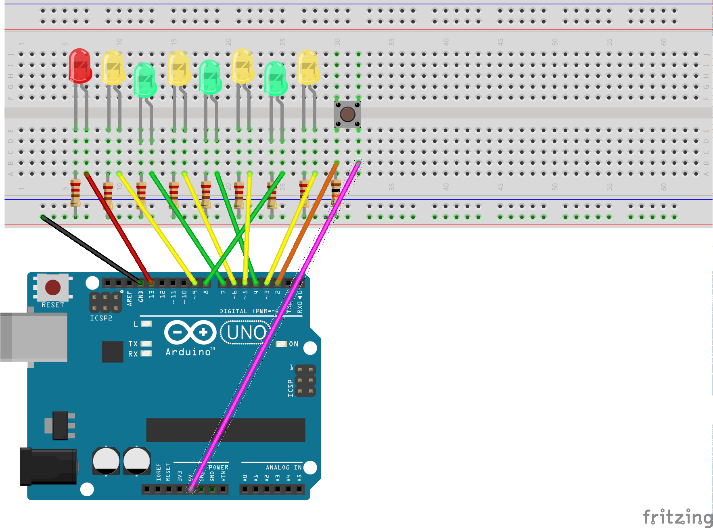

# PomodorIoT
arduino controlled Pomodoro

## Build

## Install
`` npm install ``

## Run
`` node index.js ``

  It will start the pomodoro automatically.

## API

### http://localhost:3000/finish
Finishes the running pomodoro sequence

### http://localhost:3000/start
Finishes the running pomodoro sequence and starts a new one.
